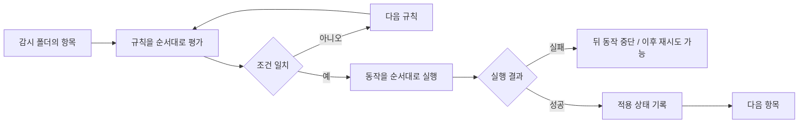
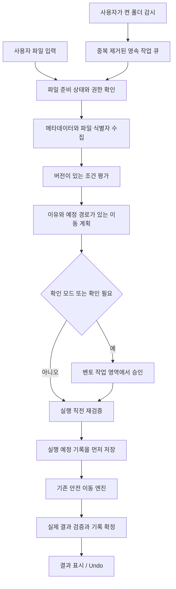

# Hazel 기능 분석과 TILES 제품 요구사항

> `verification/` 링크는 로컬 검증 자료를 가리키며 Git 저장소에는 캡처와 개인 경로가 포함된 원시 기록을 올리지 않습니다.

> 2026-09-11 후속 결정: 아래의 단일 파일 중심 P0는 조사 당시 제안이다. 현재 구현 범위는 [프로젝트·템플릿 정리 PRD](project-organization-prd.md)를 따른다. Hazel 분석과 과거 검증 근거는 그대로 보존한다.

TILES에 가장 먼저 도입할 것은 **폴더 추천 → 사용자의 선택 → 같은 선택을 다시 제안하는 규칙 → 사용자가 켜는 자동화**의 연결이다. Hazel의 넓은 기능 범위는 장기 확장에 참고하되, 첫 경험은 파일 한 개를 원하는 위치로 옮기는 일에 집중한다. 기존 **벤토 그리드, 타일의 슬라이딩 퍼즐 모션, TILES 워드마크**는 유지한다.

이 문서는 공식 문서 조사와 2026년 9월 11일 설치본 직접 검증을 함께 사용한다. 실제로 실행한 범위와 설정 화면만 확인한 범위는 [실사용 검증 보고서](hazel-native-validation-20260911.md)에 구분했다. 가치와 UX에 대한 평가는 분석이며, TILES 요구사항은 제안이다. 구현된 기능은 13장의 현황 표에 별도로 표시한다.

## 1. 제품 판단

Hazel은 사용자가 지정한 폴더를 관찰하고, 파일의 조건에 따라 정해진 작업을 실행하는 Mac 자동화 제품이다. 규칙은 폴더에 속하며 하나 이상의 조건과 동작으로 구성된다. 따라서 제품의 중심 객체는 ‘정리할 파일 목록’보다 ‘지속해서 적용할 폴더별 정책’에 가깝다. [1. About Folders & Rules](https://www.noodlesoft.com/manual/hazel/hazel-basics/about-folders-rules/)

가장 큰 가치는 **같은 분류 판단과 조작을 반복하지 않아도 되는 것**이다. 파일이 생길 때마다 폴더를 찾고, 이름을 바꾸고, 태그를 붙이던 작업을 사전에 정한 기준으로 대신한다. 정리 규칙이 안정된 사람에게는 높은 효용이 있지만, 아직 어디에 저장할지 모르는 사람은 규칙부터 만드는 과정에서 막힐 수 있다. 이 차이가 TILES의 진입점이다.

| 판단 항목 | Hazel에서 배울 점 | TILES의 제품 결정 |
|---|---|---|
| 첫 성공 | 한 번 설정한 규칙의 반복 실행 | 규칙 작성 전에 파일 한 개 이동을 완료 |
| 정리 기준 | 사용자가 정의한 조건과 동작 | 실제 폴더를 추천하고, 선택의 범위를 사용자가 확인 |
| 통제감 | 미리보기, 실행 상태, 중지, 일부 변경 복구 | 이동 전 목적지 확인과 실행 후 되돌리기를 기본 흐름에 배치 |
| 확장성 | 다양한 속성, 패턴, 스크립트 | 이름·종류·기간 조건부터 단계적으로 확장 |
| 정보 구조 | 폴더와 규칙 중심 편집기 | 현재 파일과 다음 행동 중심의 벤토 작업 영역 |
| 신뢰 형성 | 반복 실행의 일관성 | 이유가 보이는 추천과 검토 후 켜는 자동화 |

우선 검증할 고객 가설은 다운로드·문서·작업 자료가 쌓이지만 자동화 규칙 작성에는 익숙하지 않은 Mac 사용자다. 디자이너와 개발자의 원본·프로젝트 파일은 경로에 의존할 수 있으므로, ‘모든 파일을 더 많이 옮김’을 성공 지표로 삼지 않는다.

## 2. 조사 범위와 버전상 주의점

공식 릴리스 페이지에서 확인한 최신 게시 버전은 **Hazel 6.1.2, 2026년 2월 18일**, 최소 요구사항은 **macOS 13**이다. 6.1에서는 클라우드에만 존재하는 파일의 처리 옵션과 미리보기의 백그라운드 실행이 추가되었다. 다만 공개 온라인 매뉴얼에서 해당 클라우드 옵션의 모든 선택지와 공급자별 동작을 확인할 수 없어, 그 부분은 구현을 단정하지 않는다. [2. Hazel Release Notes](https://www.noodlesoft.com/release_notes), [3. Hazel 6.1 Release Notes](https://www.noodlesoft.com/kb/hazel-6-1-release-notes/)

온라인 매뉴얼에는 버전 차이가 있다. 예를 들어 폴더 참조 일괄 변경은 매뉴얼에서 ‘Relocate Folder’로 설명하지만, 공식 포럼 관리자는 2026년 3월에 현재 명칭이 **Folder 메뉴의 Replace Folder**라고 안내했다. 설치된 6.1.2의 Folder 메뉴에서도 `Replace Folder…`를 직접 확인했다. 명칭과 위치를 확인한 것이며 폴더 참조 교체를 실행한 것은 아니다. [4. Relocating Folders](https://www.noodlesoft.com/manual/hazel/attributes-actions/action-reference/relocating-folders/), [5. 공식 관리자 안내](https://www.noodlesoft.com/forums/viewtopic.php?f=4&t=17094), [실제 메뉴](../../verification/hazel-native-20260911/09-folder-menu.png)

설치본은 **Hazel 6.1.2, build 2541**이며 macOS 26.5.2의 Intel Mac에서 조사했다. 앱 번들의 `LSMinimumSystemVersion`은 **13.5**여서, 위 공개 릴리스의 macOS 13 표기와 정밀도가 다르다. 임시 폴더에서 조건 미리보기, 실제 이동, 이름 충돌, Finder Revert, 규칙 우선순위, 비활성화 후 복사, 일시정지 중 수동 실행을 확인했다. 시험용 감시 등록은 제거했고 기존 Downloads의 규칙 목록·활성 상태는 시험 직전과 일치했다. [실행·정리 증거](../../verification/hazel-native-20260911/README.md)

30개 기본 동작의 메뉴 존재와 일부 고급 옵션 화면도 확인했지만 모든 동작을 실행한 것은 아니다. OCR 정확도, 클라우드 공급자별 동작, 외부 자동화, 접근성 적합성, CPU·메모리·대규모 처리 성능은 검증하지 않았다. Hazel 내부 감시 API·데이터베이스·스케줄러 구현도 확인하지 않았으므로 뒤의 시스템 설계는 **TILES를 위한 제안**이다.

## 3. Hazel의 핵심 실행 로직

1. 감시 폴더 안의 파일 또는 폴더를 대상으로 규칙 목록을 위에서부터 평가한다.
2. 조건이 맞지 않으면 다음 규칙을 평가한다. 기본적으로 **처음 일치한 규칙 하나**의 동작들을 순서대로 실행한다.
3. `Continue matching rules`를 지정하면 이후 규칙도 평가한다. 규칙 순서가 결과에 영향을 준다.
4. 동작이 실패하면 그 파일에 대한 뒤의 동작은 실행하지 않는다. 이후 검사에서 조건이 계속 맞으면 재시도할 수 있다.
5. 성공한 규칙은 같은 파일에 매번 반복 적용하지 않는다. 조건 변경이나 불일치 후 재일치 등은 재실행 계기가 될 수 있다.
6. 감시 폴더에 남은 항목은 이후에도 평가 대상이다. 시간이 지나 조건을 만족하게 되는 규칙도 작동한다. [6. Understand the Logic of Rules](https://www.noodlesoft.com/manual/hazel/work-with-folders-rules/create-edit-rules/understand-the-logic-of-rules/)

기본 범위는 감시 폴더의 바로 아래 항목이다. 하위 폴더 내부까지 적용하려면 별도 감시 폴더로 등록하거나 `Run rules on folder contents`를 사용한다. 후자는 재귀적으로 내려갈 수 있으므로 깊이 제한과 규칙 순서가 필요하다. **폴더의 속성을 검사하는 것과 폴더 안의 파일들을 실행 대상으로 삼는 것은 다르다.** [7. Processing Subfolders](https://www.noodlesoft.com/manual/hazel/advanced-topics/processing-subfolders/)

이 구조의 UX적 장점은 ‘이런 파일이면 이렇게 한다’는 설명이 실행 결과와 연결된다는 점이다. 반면 규칙이 겹치거나 재귀·계속 평가를 조합하면 사용자가 실행 순서를 추론해야 한다. TILES 초기 자동화에서는 동작을 ‘한 폴더로 이동’ 하나로 제한하고 충돌을 먼저 보여주는 편이 이해하기 쉽다.

## 4. 전체 기능 분석

### 4.1 감시 대상과 폴더 관리

일반 폴더를 선택하거나 드래그해서 등록하고, 브라우저·메일 등의 다운로드 폴더를 앱 폴더로 연결할 수 있다. Finder의 저장된 검색인 Smart Folder도 사용할 수 있지만 하위 파일 검사와 하위 폴더 순회에는 제한이 있다. 폴더 그룹은 목록을 정리하며, 그룹 자체에 규칙을 적용하는 구조는 아니다. 폴더를 등록하는 것만으로 파일이 변경되지는 않는다. [8. Manage Folders](https://www.noodlesoft.com/manual/hazel/work-with-folders-rules/manage-folders/)

**사용자 여정:** 파일이 쌓이는 위치 발견 → 감시 폴더 등록 → 그 폴더의 규칙 작성 → 켜기 → 일상 작업 중 자동 처리 확인.

**가치 분석:** 실행할 때마다 출발점을 지정할 필요가 없고, 다운로드 같은 기존 습관을 바꾸지 않아도 된다. TILES에서는 파일 한 번 정리하기와 폴더 계속 지켜보기를 서로 다른 선택으로 표시해야 한다. 파일을 드롭했다고 그 부모 폴더의 상시 감시까지 허용한 것으로 해석하면 안 된다.

### 4.2 조건과 메타데이터

공개 속성은 다음 범위를 포함한다. [9. Attribute Reference](https://www.noodlesoft.com/manual/hazel/attributes-actions/attribute-reference/)

| 조건 영역 | 사용할 수 있는 정보 |
|---|---|
| 이름 | 이름, 확장자, 확장자를 포함한 전체 이름 |
| 시간 | 폴더 추가일, 생성일, 수정일, 마지막 열람일, 마지막 성공 매칭일, 현재 시간 |
| 형태·상태 | 파일 종류, 크기, 잠금 여부 |
| Finder 정보 | 태그, 색상 라벨, 주석 |
| 내용·출처 | 텍스트 내용, 출처 URL·이메일 주소 |
| 폴더 구조 | 하위 깊이, 바로 아래 파일·폴더 수 |
| 확장 | Any File, Spotlight 속성, AppleScript·JavaScript·shell 조건 |

출처 정보는 일부 앱이 기록한 경우에만 쓸 수 있다. ‘만든 날짜’와 ‘이 폴더에 들어온 날짜’도 다른 정보다. 내용을 읽기 위한 OCR은 인식 결과를 원본 PDF에 저장하지 않으며, 암호화된 PDF는 규칙별 암호를 지정할 수 있고 키체인에 보관한다. 하나의 규칙에 문서 암호 하나를 설정하는 제약이 있다. [9. Attribute Reference](https://www.noodlesoft.com/manual/hazel/attributes-actions/attribute-reference/)

**사용자 여정:** 분류 기준 선택 → 속성과 비교 방식 설정 → 파일로 조건 확인 → 필요한 경우 추가 조건 결합.

**가치 분석:** 이름이 불규칙해도 날짜·종류·본문으로 규칙을 만들 수 있다. 다만 누락된 출처나 읽지 못한 내용을 ‘조건이 아니다’라고 단순 처리하면 사용자가 예측하기 어렵다. TILES는 ‘불일치’와 ‘확인할 수 없음’을 분리해야 한다.

### 4.3 논리 결합과 관계 조건

조건을 `all / any / none`으로 결합하고 중첩할 수 있다. 검사 대상도 현재 항목, 부모 폴더, 같은 폴더의 다른 항목, 하위 항목 등으로 바꿀 수 있다. 다만 다른 항목의 정보를 검사해도 **동작은 현재 처리 중인 항목에 적용**된다. [10. Using Nested Conditions](https://www.noodlesoft.com/manual/hazel/advanced-topics/using-nested-conditions/)

**사용자 여정:** 단일 조건 생성 → 조건 그룹 추가 → AND·OR·부정 및 검사 대상 설정 → 대표 파일과 예외 파일로 미리보기.

**가치 분석:** 동반 파일의 존재, 폴더 전체의 상태처럼 업무 맥락을 표현할 수 있다. 대신 중첩 깊이와 검사 대상이 이해 비용을 높인다. TILES P1은 최대 세 개의 AND 조건을 제공하고, OR·관계 조건은 고급 사용의 필요가 검증된 뒤 확장한다.

### 4.4 패턴 추출과 재사용

문자·숫자·단어·임의 문자열 등의 토큰을 조합해 이름이나 내용의 패턴을 검사할 수 있다. 사용자 정의 텍스트·날짜 값은 뒤의 조건이나 동작에서 재사용된다. [11. Using Match Patterns in Conditions](https://www.noodlesoft.com/manual/hazel/attributes-actions/attribute-reference/using-match-patterns-in-conditions/), [12. Using Custom Attributes](https://www.noodlesoft.com/manual/hazel/attributes-actions/attribute-reference/using-custom-attributes/)

| 사용자 정의 값 | 역할 | 업무상 가치 |
|---|---|---|
| Text / Date | 일치하는 문자열 또는 날짜를 캡처 | 문서에서 얻은 거래처·문서일자를 이름과 경로에 재사용 |
| List Item | 미리 정한 목록 중 한 항목을 매칭 | 여러 프로젝트 이름을 개별 규칙으로 늘리지 않음 |
| List | 일치한 여러 값을 모아서 후속 동작에 전달 | 부모 폴더의 여러 태그를 파일에 적용 |
| Table | 한 열의 일치 행을 찾아 다른 열 값을 참조 | 고객명 → 고객 코드·보관 위치 매핑 |

목록 항목과 표는 내부에 입력하거나 외부 텍스트 파일에서 읽을 수 있다. List는 ‘목록 중 하나를 검사’하는 List Item과 구별된다. [13. Custom List Item Attributes](https://www.noodlesoft.com/manual/hazel/attributes-actions/attribute-reference/using-custom-attributes/custom-list-item-attributes/), [14. Custom List Attributes](https://www.noodlesoft.com/manual/hazel/attributes-actions/attribute-reference/using-custom-attributes/custom-list-attributes/), [15. Custom Table Attributes](https://www.noodlesoft.com/manual/hazel/attributes-actions/attribute-reference/using-custom-attributes/custom-table-attributes/)

**사용자 여정:** 대표 파일 선택 → 바뀌는 부분을 토큰으로 지정 → 추출 값 확인 → 이름·태그·경로 템플릿에 연결 → 다른 파일로 확인.

**가치 분석:** 단순 분류를 넘어 업무의 명명 체계를 자동화한다. TILES에서는 고객명 매핑표나 OCR을 처음부터 열어두기보다, 사용자가 만든 폴더와 명시적으로 선택한 파일명 접두어를 첫 재사용 단위로 삼는다.

### 4.5 기본 동작 전체 목록

공식 Action Reference에 열거된 동작은 아래 **30종**이다. 설치된 6.1.2의 동작 메뉴에서도 같은 30종의 존재를 확인했다. 메뉴 존재 확인과 실제 동작 검증은 구별한다. 동작 이름은 기능의 대응 관계를 명확히 하기 위해 원문을 함께 남겼다. [16. Action Reference](https://www.noodlesoft.com/manual/hazel/attributes-actions/action-reference/), [설치본 메뉴 목록](../../verification/hazel-native-20260911/action-menu-verified.json)

| 기능군 | 동작 | 핵심 역할 |
|---|---|---|
| 배치 | Move, Copy, Rename, Sort into subfolder | 위치·이름·하위 분류 변경 |
| 전송 | Sync, Upload | 다른 위치 또는 서버에 전달 |
| 메타데이터 | Add tags, Remove tags, Set color label, Add comment | 검색·분류 정보 편집 |
| 파일 상태 | Toggle extension, Toggle lock | 확장자 표시·잠금 설정 |
| 압축 | Archive, Unarchive | 압축·해제 |
| 탐색 | Open, Show in Finder, Make alias | 열기·위치 표시·별칭 생성 |
| 라이브러리 | Import into Music, Import into Photos, Import into TV | 앱 라이브러리로 가져오기 |
| 외부 작업 | Run Shortcut, Run AppleScript, Run JavaScript, Run Automator workflow, Run shell script | 외부 자동화 실행 |
| 실행 제어 | Pause, Run rules on folder contents, Continue matching rules, Ignore | 대기·재귀·후속 평가·제외 |
| 결과 전달 | Display notification | 사용자 알림 |

이동·복사에는 이름 충돌과 중복 처리 옵션이 있다. Copy 다음의 동작은 복사본에 적용된다. Archive·Unarchive 다음의 동작도 변환 결과에 적용되며 원본은 휴지통으로 이동한다. 따라서 동작 목록은 독립 버튼의 모음이 아니라 **대상이 바뀔 수 있는 실행 순서**다. [16. Action Reference](https://www.noodlesoft.com/manual/hazel/attributes-actions/action-reference/)

### 4.6 이름·경로·태그 생성

동작의 패턴에 고정 텍스트와 속성 토큰을 넣어 이름·하위 폴더·태그·주석·알림을 만든다. 값의 대소문자, 날짜·숫자 형식, 문자열 치환, 기본값, 최대 길이 등을 조정할 수 있다. Rename에는 폴더별 카운터가 있고 증가 방식과 사용 가능한 낮은 번호 선택 등을 설정할 수 있다. [17. Using Patterns in Actions](https://www.noodlesoft.com/manual/hazel/attributes-actions/action-reference/using-patterns-in-actions/), [18. Using the Counter Attribute](https://www.noodlesoft.com/manual/hazel/attributes-actions/action-reference/using-patterns-in-actions/using-the-counter-attribute/)

Move·Copy·Upload는 원래 부모만, 감시 루트부터의 상대 구조, 볼륨 루트 기준 구조를 목적지에 재현하는 옵션도 제공한다. 목적지 참조의 일괄 교체는 규칙을 고치는 작업이며 실제 폴더를 이동하는 작업과 구분된다. [19. Copying Folder Structure](https://www.noodlesoft.com/manual/hazel/attributes-actions/action-reference/copying-folder-structure/), [4. Relocating Folders](https://www.noodlesoft.com/manual/hazel/attributes-actions/action-reference/relocating-folders/)

**사용자 여정:** 원하는 결과 형태 작성 → 속성 토큰 삽입 → 예시 결과 확인 → 실제 파일 적용 → 필요하면 폴더 참조 변경.

**가치 분석:** 파일을 나중에 다시 찾기 쉬운 일관된 이름과 구조를 만든다. TILES 초기 버전은 파일 이름을 유지하고 목적지만 결정한다. 이름 변경과 날짜별 폴더는 이동의 신뢰가 확보된 다음 별도 미리보기와 함께 제공한다.

### 4.7 파일 동기화와 업로드

파일의 Sync는 **단방향**이다. 목적지 변경을 원본으로 되돌리지 않으며, 일반적인 파일별 규칙에서는 원본 삭제가 기본적으로 전파되지 않는다. 하위 폴더 자체를 동기화하는 방식에서는 삭제 전파가 가능해 의미가 달라진다. 전용 양방향 동기화 제품과 동일하게 취급하면 안 된다. [20. Syncing Folders](https://www.noodlesoft.com/manual/hazel/advanced-topics/syncing-folders/)

Upload는 FTP 계열, SFTP, WebDAV 계열 서버에 연결한다. 서버·계정·목적 경로를 설정하고, 암호는 키체인에 저장하며 SFTP는 SSH 키도 사용할 수 있다. [21. Specifying Upload Options](https://www.noodlesoft.com/manual/hazel/attributes-actions/action-reference/specifying-upload-options/)

**사용자 여정:** 전송 대상 연결 → 전송 조건 작성 → 충돌 정책 확인 → 실행 → 서버 또는 대상 폴더에서 결과 확인.

**가치 분석:** 정리 후 전달 작업까지 연결한다. 그러나 네트워크 실패, 외부 사본, 삭제 전파, 충돌 해결이 파일 정리와 별도의 복구 문제를 만든다. TILES MVP에서는 로컬 동일 볼륨 이동에 집중하고 원격 전송과 동기화를 제외한다.

### 4.8 외부 자동화와 macOS 연동

AppleScript·JavaScript는 조건 검사와 동작에 사용할 수 있고, 입력 속성과 사용자 정의 출력 속성을 주고받는다. 스크립트는 처리 대상을 바꾸거나 후속 동작을 멈출 수도 있다. 실패는 오류로 전달해야 하며 단순 반환값만으로 실패가 되는 것은 아니다. [22. Using AppleScript or JavaScript](https://www.noodlesoft.com/manual/hazel/attributes-actions/using-applescript-or-javascript/)

Shell은 현재 파일 경로를 인자로 받으며 조건과 동작에서 사용할 수 있다. Terminal 환경과 같다고 가정하면 안 되고, AppleScript처럼 사용자 정의 속성을 입출력하는 방식도 동일하지 않다. Shortcuts와 Automator는 조건용이 아니라 실행 동작용이다. [23. Using Shell Scripts](https://www.noodlesoft.com/manual/hazel/attributes-actions/using-shell-scripts/), [24. Using Shortcuts](https://www.noodlesoft.com/manual/hazel/attributes-actions/using-shortcuts/), [25. Using Automator](https://www.noodlesoft.com/manual/hazel/attributes-actions/using-automator/)

**사용자 여정:** 파일 입력을 받을 외부 작업 준비 → 규칙의 실행 단계에 연결 → 정상·오류 사례 실행 → 후속 동작과 실패 전달 확인.

**가치 분석:** 앱의 기본 동작으로 처리할 수 없는 업무까지 확장한다. TILES에서 채택한다면 Shortcuts를 먼저 검토하고, 외부 작업 결과는 이동 되돌리기의 보장 범위에 포함하지 않아야 한다. 스크립트 편집기는 초기 제품의 이해 비용과 지원 부담이 커서 후순위다.

### 4.9 미리보기, 실행 상태, 복구

Preview Rule은 대표 파일 하나에 대해 조건별 일치 여부와 실제 속성 값을 확인한다. **동작을 실행하지 않으므로 목적지 쓰기 성공이나 외부 작업 성공을 보장하는 실행 시뮬레이터는 아니다.** 비활성 규칙도 미리 볼 수 있다. Rule Status는 폴더의 항목별 일치 규칙, 시각, 오류를 보여준다. [26. Preview a Rule](https://www.noodlesoft.com/manual/hazel/work-with-folders-rules/create-edit-rules/preview-a-rule/), [27. Show Rule Status](https://www.noodlesoft.com/manual/hazel/work-with-folders-rules/manage-rules/show-rule-status/)

Revert는 이동·이름·하위 분류, 태그·라벨·주석, 확장자 표시·잠금, 압축·해제 등에 적용된다. Copy·Sync·Upload·별칭·외부 앱 가져오기·자동화 실행은 포함하지 않는다. ‘규칙 전체를 완전히 롤백’하는 기능으로 설명하면 과장이다. [28. Revert a File](https://www.noodlesoft.com/manual/hazel/work-with-folders-rules/manage-rules/revert-a-file/)

**사용자 여정:** 대표 파일로 조건 확인 → 실제 실행 → Rule Status에서 결과 점검 → 예상과 다르면 중지 → 지원되는 변경을 Revert → 규칙 수정.

**가치 분석:** 사용자가 자동화의 근거와 실패 원인을 확인할 수 있다. TILES는 추천 근거, 이동 예정 경로, 실행 전 검사, 실행 결과를 구별해 보여주고, 되돌릴 수 없는 경우에는 사유와 현재 두 위치를 제공해야 한다.

### 4.10 중지·수동 실행·알림·운영 UI

개별 규칙 비활성화, 폴더 단위 일시 정지, Hazel 전체 중지를 구분한다. 전체 중지는 규칙과 휴지통 처리도 멈춘다. 수동 실행은 이미 적용된 규칙의 동작을 다시 실행할 수 있어 단순 새로고침과 다르다. [29. Enable, Disable, or Pause Rules](https://www.noodlesoft.com/manual/hazel/work-with-folders-rules/manage-rules/enable-disable-or-pause-rules/), [30. Stopping & Restarting Hazel](https://www.noodlesoft.com/manual/hazel/hazel-basics/stopping-restarting-hazel/), [31. Run Rules Manually](https://www.noodlesoft.com/manual/hazel/work-with-folders-rules/manage-rules/run-rules-manually/)

메인 창은 폴더 목록·규칙 목록·편집기를 중심으로 구성되고, 규칙 검색과 편집기 분리를 지원한다. 검색은 이름·메모뿐 아니라 규칙 필드와 내장 스크립트까지 포함한다. 메뉴 막대는 실행 상태와 빠른 제어를 제공하며 메뉴 표시 자체가 규칙 실행의 필수 조건은 아니다. [32. The Main Hazel Window](https://www.noodlesoft.com/manual/hazel/hazel-basics/main-hazel-window/), [33. Search Rules](https://www.noodlesoft.com/manual/hazel/work-with-folders-rules/create-edit-rules/search-rules/), [34. The Hazel Status Menu](https://www.noodlesoft.com/manual/hazel/hazel-basics/hazel-status-menu/)

알림은 오류, 기본 동작의 파일 이벤트, 휴지통 이벤트, 사용자 정의 메시지로 나뉜다. [35. Notifications](https://www.noodlesoft.com/manual/hazel/hazel-basics/notifications/)

**사용자 여정:** 메뉴 막대에서 상태 확인 → 필요한 범위만 정지 → 규칙 수정 또는 수동 실행 → 알림·기록 확인 → 재개.

**가치 분석:** 앱 창을 계속 열지 않아도 통제할 수 있다. TILES도 자동화를 도입할 때는 ‘전체 중지’가 쉽게 보여야 하고, 정상 처리마다 알림을 쏟기보다 실패·확인 필요를 우선 전달하는 것이 적합하다.

### 4.11 규칙 공유와 동기화

규칙은 파일로 내보내고 가져올 수 있다. 가져온 규칙은 처음에 꺼진 상태다. 내보내기는 폴더별 규칙 집합 단위이며 전체 폴더의 규칙을 각각 내보내는 기능도 제공한다. [36. Import Rules](https://www.noodlesoft.com/manual/hazel/work-with-folders-rules/manage-rules/import-rules/), [37. Export Rules](https://www.noodlesoft.com/manual/hazel/work-with-folders-rules/manage-rules/export-rules/)

규칙 동기화는 **파일 Sync와 별개**로, 한 폴더의 전체 규칙을 외부 파일을 통해 공유하는 기능이다. 두 규칙 집합을 병합하지 않고 덮어쓸 수 있으며, 규칙의 켜짐·꺼짐 상태는 동기화하지 않는다. 다른 인스턴스에 새로 전달된 규칙은 비활성 상태로 시작한다. [38. Sync Rules](https://www.noodlesoft.com/manual/hazel/work-with-folders-rules/manage-rules/sync-rules/)

**사용자 여정:** 규칙 집합 내보내기 또는 동기화 파일 생성 → 다른 환경에서 가져오기 → 대상 경로·외부 작업 확인 → 필요한 규칙 켜기.

**가치 분석:** 여러 Mac에서 정리 기준을 재사용한다. TILES에서는 먼저 로컬 백업·복원을 제공하고, 공유 시에는 실행 상태·폴더 권한을 별도로 확인하는 구조가 필요하다. 단순 JSON 동기화만으로 실행 준비가 끝났다고 표시해서는 안 된다.

### 4.12 중복·다운로드 잔여물·휴지통·앱 잔여물

폴더 옵션에는 동일한 다운로드 복제본과 오래된 미완료 다운로드를 휴지통으로 보내는 기능이 있다. 이름이 비슷한 것과 내용이 같은 중복은 구분한다. [8. Manage Folders](https://www.noodlesoft.com/manual/hazel/work-with-folders-rules/manage-folders/)

휴지통 관리는 보관 기간 또는 총크기 기준으로 **영구 삭제**한다. 매뉴얼은 보안 삭제 옵션도 설명하지만 SSD에서 기대한 보안 효과를 보장하지 않는다고 명시한다. 따라서 현대 Mac의 데이터 완전 삭제 기능으로 일반화하지 않는다. [39. Use Automatic Deletion](https://www.noodlesoft.com/manual/hazel/hazel-basics/manage-your-trash/use-automatic-deletion/)

App Sweep은 앱이 휴지통으로 이동한 것을 계기로 지원 파일을 찾아 함께 버릴지 제안한다. 항목을 제외하거나 모두 보존할 수 있고, 상호 동의한 사용자 계정 사이의 처리도 지원한다. 앱 전용 제거 프로그램이 있으면 그것을 우선 사용하도록 안내한다. [40. Use App Sweep](https://www.noodlesoft.com/manual/hazel/hazel-basics/manage-your-trash/use-app-sweep/)

**사용자 여정:** 정리 정책 켜기 → 조건에 맞는 잔여물 탐지 → 자동 또는 확인 후 휴지통 이동 → 별도의 영구 삭제 정책 적용.

**가치 분석:** 저장 공간과 유지 관리 부담을 줄인다. 하지만 분류·이동과 삭제는 사용자 기대와 복구 책임이 다르다. TILES MVP에서 자동 삭제, 휴지통 비우기, 앱 제거는 제외한다.

## 5. 대표 사용자 여정과 가치

아래는 기능을 조합한 예시 여정이며 실제 사용자 조사 결과는 아니다.

| 여정 | 단계 | 가장 큰 가치 | UX에서 주의할 점 |
|---|---|---|---|
| 다운로드 정리 | 다운로드 폴더 등록 → 파일 종류 조건 → 목적지 지정 → 대표 파일 미리보기 → 규칙 활성화 | 반복되는 수동 이동 감소 | 일반 규칙이 구체 규칙을 먼저 가로채지 않도록 순서 확인 |
| 청구서 보관 | 수신 위치 등록 → 본문·날짜 확인 → 거래처·날짜 추출 → 이름·연월 폴더 생성 → 결과 점검 | 파일명이 불규칙해도 찾기 쉬운 구조 형성 | OCR 실패·암호·문서일과 다운로드일 혼동 |
| 프로젝트 자료 관리 | 프로젝트 목록 또는 매핑표 정의 → 파일 속성과 비교 → 경로·태그 적용 → 필요 시 전달 | 팀이나 업무의 분류 체계 유지 | 원본·프로젝트 내부 파일의 경로 의존성 |
| 새 규칙 디버깅 | 정지 또는 비활성화 → 대표·예외 파일 미리보기 → 실제 실행 → 상태 검사 → 지원 범위 복구 | 잘못된 자동화의 원인 파악 | 조건 일치와 실행 성공을 혼동하지 않음 |
| 여러 Mac에 적용 | 내보내기·동기화 → 다른 환경에서 불러오기 → 경로 확인 → 규칙 켜기 | 정리 기준을 다시 만들지 않음 | 규칙 동기화와 파일 동기화, 덮어쓰기 구분 |
| 공간 정리 | 잔여물 정책 설정 → 휴지통 이동 → 보존 여부 확인 → 영구 삭제 | 유지 관리 반복 감소 | 자료 정리와 삭제의 범위를 구별 |

Hazel의 강점은 규칙 표현력뿐 아니라 **설정 → 관찰 → 설명 → 제어**의 운영 흐름이다. TILES가 규칙 편집기만 도입하면 복잡성은 늘고 이 가치는 충분히 얻지 못한다. 추천과 첫 이동을 먼저 해결하고, 실행 근거와 복구를 갖춘 뒤 자동화를 추가해야 한다.

## 6. TILES PRD: 목적과 범위

### 제품 목표

사용자가 파일을 가져왔을 때 다음 행동을 바로 이해하고, 실제 폴더에 안전하게 옮긴 뒤 그 선택을 재사용할 수 있게 한다. 반복 패턴이 확인되면 사용자가 지정한 폴더에서만 자동화를 켤 수 있게 한다.

### 핵심 사용자 이야기

- 저장 위치가 정해지지 않은 사용자는 파일을 넣고 실제 사용할 수 있는 폴더를 추천받고 싶다.
- 적합한 폴더가 없는 사용자는 흐름을 벗어나지 않고 폴더를 만들고 바로 선택하고 싶다.
- 반복해서 같은 종류의 자료를 정리하는 사용자는 선택한 기준을 직접 확인하고 저장하고 싶다.
- 자동화를 켠 사용자는 무엇이 왜 이동했는지 확인하고, 멈추거나 가능한 변경을 되돌리고 싶다.

### 우선순위

| 단계 | 포함 기능 | 다음 단계로 넘어가는 조건 |
|---|---|---|
| **P0: 직접 정리** | 파일 한 개 입력, 최대 세 개 실제 폴더 추천, 직접 선택·새 폴더, 선택한 접두어 추천 규칙, 이동·기록·Undo | 처음 사용하는 사람이 설명 없이 첫 이동을 완료하고, 오류에서 다음 행동을 찾음 |
| **P1: 확인 후 자동화** | 감시 폴더 등록, 이름·종류·기간 AND 조건, 적용 파일 미리보기, 확인 대기, 규칙별 자동 실행·중지, 재시작 복구 | 이벤트 중복·중단·권한·충돌을 포함한 운영 검증 통과 |
| **P2: 분류 확장** | Finder 태그, 날짜별 하위 폴더, 이름 템플릿, 선택적 문서 내용·OCR, Shortcuts | 필요 사례가 반복되고, 각 동작의 설명·복구 범위가 정의됨 |
| **후순위** | 표·목록 기반 매핑, 고급 논리, 규칙 백업·공유 | 다수 규칙을 운영하는 사용자에게 실질적 수요 확인 |
| **초기 범위 제외** | 자동 삭제, App Sweep, 원격 업로드, 양방향 동기화, 임의 스크립트, 근거 없는 AI 자동 이동 | 별도 제품 가치·보안·복구 설계 필요 |

P0의 ‘다음에도 추천’은 자동 실행 동의가 아니다. 기존 추천 규칙을 P1 자동 규칙으로 옮길 때도 감시 폴더·조건·목적지·기존 파일 처리 범위를 다시 보여줘야 한다.

## 7. 벤토 그리드와 퍼즐 모션을 유지하는 UX

### 고정할 디자인 계약

기존 벤토 셀의 기하 구조, 타일 간격·모서리, 흑백과 파란색의 역할, 워드마크, 빈칸으로 타일이 이동하는 슬라이딩 퍼즐 원리를 유지한다. 화면의 간결함은 그리드를 없애는 대신 **같은 타일 안에서 현재 단계의 정보만 보여주는 방식**으로 만든다.

| 기존 영역 | P0의 역할 | 자동화 도입 후 역할 |
|---|---|---|
| 파일 타일 | 선택한 파일과 변경 버튼 | 검토 중인 파일 또는 선택한 감시 폴더 |
| 폴더 타일 | 선택한 목적지 | 해당 규칙의 목적지 |
| 중앙 작업 타일 | 드롭 → 폴더 후보 → 실행 결과 | 확인 대기 항목 또는 규칙 미리보기 |
| 행동 타일 | 이동, 다음 파일, 중단 | 선택 항목 이동 또는 자동화 상태 제어 |
| 숫자 타일 | 실제 현재 단계 | 실제 대기 건수가 있을 때만 그 수 표시 |
| 안내 타일 | 다음 행동 한 가지 | 해결해야 할 상태와 해결 버튼 |
| 상단 탐색 | 정리·기록·설정 | 동일하게 유지 |

큰 감성 문구는 ‘파일 정리’, ‘옮길 폴더 선택’, ‘이동 완료’처럼 짧은 기능 이름으로 대체한다. 제목은 현재 22pt 안팎의 위계를 기준으로 검토하고, 모든 타일이 각자 큰 제목을 갖지 않도록 한다. 비어 있는 수치나 임의의 성공률을 시각 장식으로 채우지 않는다.

단계 전환은 기존 퍼즐 배치로 중앙 작업 영역을 확장한다. 타일이 이동하는 동안 실행 버튼에 중복 입력이 들어오지 않아야 한다. Reduce Motion에서는 정적인 배치 전환으로 같은 정보를 제공하고, 포커스 순서는 시각적 이동과 무관하게 파일 → 폴더 → 실행 순으로 유지한다.

### 첫 이동 여정

새 폴더는 ‘폴더 이름’과 ‘만들 위치’를 보여주고 생성 후 즉시 선택한다. 추천 규칙을 저장하지 않아도 이동은 완료할 수 있다. 새 폴더 생성과 파일 이동은 별도 사용자 행동으로 기록하며, 파일 이동을 Undo했다고 사용자가 만든 폴더까지 자동 삭제하지 않는다.

### 자동화 전환 여정

성공한 정리 기록 → ‘이 방식으로 계속 정리’ → 감시 폴더 선택 → 조건·목적지 확인 → 현재 해당하는 파일 미리보기 → 기본값 ‘확인 후 이동’으로 저장 → 사용자가 ‘자동으로 이동’을 명시적으로 켠다. 자동화 설정 시 기존 파일을 일괄 처리할지와 앞으로 들어오는 파일만 처리할지를 구분하며, 기본값은 앞으로 들어오는 파일이다.

### 구체적인 도입 예시

아래 경로와 파일명은 제품 동작을 설명하기 위한 예시다. 실제 폴더는 사용자가 선택하거나 생성한다.

| 시나리오 | 화면에 보여줄 조건과 결과 | 적용 범위 |
|---|---|---|
| 프로젝트 참고 문서 | `Setly_회의.txt` 선택 → `문서/자료/Setly` 선택 또는 생성 → ‘이름이 Setly로 시작하면 다음에도 이 폴더 추천’ 선택 → 이동 | P0. 자동 이동 없이 다음 후보에만 반영. 프로젝트 내부 원본은 기존 보호 정책 적용 |
| 받은 영수증 | 감시 폴더 `다운로드` → 이름이 `영수증`으로 시작 AND 종류 PDF → `문서/영수증`으로 이동 | P1. 처음에는 확인 대기. 미리보기에 `영수증_09.pdf`를 포함하고 `견적서.pdf`를 제외. 이후 사용자가 자동 실행 선택 |
| 오래 남은 이미지 | 감시 폴더 `다운로드` → 종류 이미지 AND 폴더에 들어온 지 14일 이상 → 선택한 `문서/이미지 보관`으로 이동 | P1. 날짜 기준을 폴더 유입 시점으로 표시. 최초 등록 때 나이를 확정할 수 없는 기존 파일은 확인 대기 |
| 날짜별 영수증 | 위 영수증 규칙 → 문서에서 확인한 날짜로 `영수증/2026/09` 하위 폴더 생성 | P2. 날짜를 못 읽으면 임의로 현재 날짜를 넣지 않고 확인 대기 |

첫 번째 시나리오에서 저장된 추천 규칙을 두 번째와 같은 자동화로 확장하려면 감시 폴더를 새로 지정해야 한다. 특정 이름을 한 번 선택한 사실만으로 Mac 전체의 같은 이름 파일을 이동하지 않는다.

## 8. 기능 요구사항과 수용 기준

### P0 요구사항

| ID | 요구사항 | 수용 기준 |
|---|---|---|
| FR-01 | 파일 입력 | 드롭과 파일 선택 모두 같은 처리 경로를 사용한다. 지원 불가 항목은 이동하지 않고 이유와 가능한 행동을 보여준다. 최초에는 폴더 연결이 필수 단계가 아니다. |
| FR-02 | 추천 폴더 | 실제 존재하고 접근 가능한 후보를 최대 세 개 보여준다. 이름·경로·추천 이유가 보인다. 같은 폴더의 중복 표시와 현재 부모 폴더 추천을 피한다. |
| FR-03 | 추천 근거 | 명시적 접두어 규칙, 연결한 폴더의 분류, 완료된 이동의 사용 이력, Mac 기본 폴더를 서로 구별한다. 숫자형 신뢰도를 임의로 만들지 않는다. |
| FR-04 | 대안 제공 | 후보가 없어도 ‘폴더 선택’과 ‘새 폴더’가 노출된다. ‘목적지를 먼저 연결하세요’ 문구만으로 막히지 않는다. |
| FR-05 | 새 폴더 | 상위 위치와 이름을 보여주고 경로 구성 요소를 검증한다. 동일 이름 폴더가 있으면 덮어쓰지 않고 기존 폴더 사용 여부를 명확히 한다. 생성 후 바로 선택한다. |
| FR-06 | 추천 규칙 저장 | 사용자가 켠 경우에만 접두어와 목적지를 저장한다. 현재 파일이 그 조건에 실제로 맞아야 한다. 이동이 성공한 뒤 저장하고, 저장 실패는 이동 실패와 구분한다. |
| FR-07 | 이동 확인 | 실행 직전 선택 파일·원래 위치·최종 목적지와 파일명을 보여준다. 이름 충돌로 새 이름을 제안할 때도 변경 전후를 확인할 수 있다. 파일과 목적지의 동일성을 재검사하고 덮어쓰지 않는다. |
| FR-08 | 결과와 복구 | 성공 이후 Finder 열기와 ‘이동 되돌리기’를 결과 화면·기록에서 제공한다. 규칙 편집 취소와 구별한다. Undo 전에도 현재 파일과 원래 위치를 검사하고, 파일 변경·충돌 시 상태를 보존하며 해결 방법을 보여준다. |
| FR-09 | 기록 | 실행 시도·결과·출발지·최종 목적지·규칙 근거를 보존한다. 파일이 감시 폴더를 떠나도 완료 기록은 남는다. 실패·중단·되돌린 이동은 성공한 정리 학습 표본에 포함하지 않으며, 명시적으로 저장한 규칙은 별도로 관리한다. |
| FR-10 | 기존 기능 접근 | 폴더 전체 정리는 보조 진입점으로 유지하고 고급 규칙은 펼쳐서 편집한다. 기록의 복구 기능은 숨기지 않는다. |

### P1 요구사항

| ID | 요구사항 | 수용 기준 |
|---|---|---|
| FR-11 | 감시 범위 | 사용자가 폴더를 직접 선택한다. 기본은 바로 아래 파일, 재귀는 별도 선택이다. 드롭 파일의 부모 추론을 상시 감시 동의로 재사용하지 않는다. |
| FR-12 | 간단한 조건 | 이름의 경계 있는 접두어·포함, 파일 종류, 폴더에 들어온 뒤 경과 기간 중 최대 세 개를 AND로 결합한다. ‘확장자를 제외한 이름’·‘확장자 포함 전체 이름’과 날짜의 기준을 명시한다. |
| FR-13 | 규칙 적용 범위 | 규칙마다 감시 폴더와 목적지를 가진다. 같은 접두어라도 감시 폴더가 다르면 별개 규칙이다. 기존 추천 규칙을 몰래 자동 실행 규칙으로 바꾸지 않는다. |
| FR-14 | 조건 결과 | `일치 / 불일치 / 확인 불가`와 판정에 사용한 실제 속성 값을 확인할 수 있다. 속성 읽기 실패나 내용 미지원 상태가 부정 조건을 만족한 것으로 바뀌지 않는다. |
| FR-15 | 미리보기 | 일치·불일치 대표 파일로 시험할 수 있고, 예정 경로·이름 충돌·보호·권한 문제를 파일별로 보여준다. 조건 검사와 실행 가능성 검사 결과를 별도 표시한다. 미리보기 중 파일을 수정하지 않으며 실제 실행 직전에 다시 검사한다. |
| FR-16 | 실행 모드 | 새 규칙은 ‘확인 후 이동’이 기본이다. 자동으로 이동하려면 해당 규칙의 전환을 명시적으로 선택한다. 저장 버튼을 자동화 활성화 동의로 대체하지 않는다. |
| FR-17 | 중복 규칙 | 한 파일이 여러 이동 규칙에 맞으면 충돌을 표시한다. 초기 정책은 확인 대기로 보내고 임의로 먼저 이동하지 않는다. 제외·보호는 일반 이동 규칙보다 우선한다. |
| FR-18 | 대기와 중지 | 파일·규칙·폴더·전체 수준의 보류를 구분한다. ‘감시 일시정지’ 중 수동 실행은 대상·예상 결과를 다시 확인한 명시적 명령으로만 허용한다. 전체 중지 후에는 새 이동을 시작하지 않는다. 진행 중인 원자적 작업은 마친 뒤 실제 결과를 기록한다. |
| FR-19 | 재시도 | 일시적인 준비 상태는 제한적으로 재시도한다. 권한·충돌·변경된 목적지는 사용자 확인 대기로 전환한다. 이미 성공한 같은 실행을 중복 적용하지 않는다. |
| FR-20 | 재시작·규칙 변경 | 앱 종료·재시작 후 실제 파일 상태와 기록을 대조한다. 규칙 수정은 새 revision을 만들고 이미 승인된 계획을 무효화한다. Undo 직후 같은 규칙이 파일을 다시 옮기지 않는다. |
| FR-21 | 메뉴 막대·알림 | 자동화 상태와 전체 중지가 보인다. 오류·확인 필요는 행동과 함께 알리고, 반복 성공은 묶어서 표시하거나 알림 없이 기록한다. |
| FR-22 | 최초 감시 시작 | 기존 파일 처리 여부를 별도로 선택한다. 새 파일만 처리할 때는 초기 목록을 기준선으로 저장한다. 나중에 수정된 기존 파일을 처리할지는 규칙에서 명시한다. |

### P2 요구사항

| ID | 요구사항 | 수용 기준 |
|---|---|---|
| FR-23 | 태그·이름·날짜 폴더 | 변경 전후를 보여준다. 날짜 출처·형식·빈 값 처리·이름 충돌을 명시하고 동작별 복구 범위를 기록한다. |
| FR-24 | 내용·OCR | 사용자가 켠 규칙과 지원 문서에만 적용한다. 검색 가능한 텍스트가 있으면 이를 우선하며 OCR 사용 여부와 추출 값을 확인할 수 있다. 읽기 불가·인식 실패·빈 내용을 구분하고 원본은 변경하지 않는다. 암호는 로그·규칙 본문에 남기지 않는다. |
| FR-25 | Shortcuts | 연결된 작업과 전달 파일을 보여주고 이동 결과와 외부 작업 결과를 별도 기록한다. 외부 작업을 이동 Undo로 복구할 수 있다고 표시하지 않는다. |

## 9. 상태별 문구와 해결 행동

모든 실패 상태를 ‘확인해 주세요’ 하나로 합치지 않는다. 문구는 사용자에게 필요한 정보와 다음 행동을 같은 위치에서 제공한다.

| 상태 | 표시 문구 예시 | 행동 |
|---|---|---|
| 파일 없음 | 정리할 파일을 놓으세요 | 파일 선택 |
| 추천 없음 | 폴더를 선택하거나 새로 만드세요 | 폴더 선택 / 새 폴더 |
| 원본 접근 거부 | 이 파일의 원래 폴더에 접근할 수 없습니다 | 원래 폴더 선택 |
| 목적지 접근 거부 | 이 폴더에 파일을 저장할 수 없습니다 | 폴더 다시 선택 |
| 파일 준비 중 | 파일 저장이 끝나기를 기다리고 있습니다 | 잠시 기다리기 / 이번 파일 건너뛰기 |
| 클라우드 원본 미준비 | 파일을 Mac에 내려받은 뒤 다시 시도하세요 | Finder에서 보기 / 다시 확인 |
| 다른 볼륨 | 현재는 같은 디스크 안의 이동을 지원합니다 | 다른 폴더 선택 |
| 이름 충돌 | 같은 이름의 파일이 있습니다 | 두 파일 보기 / 다른 폴더 선택 |
| 규칙 충돌 | 적용할 규칙이 두 개 있습니다 | 이번 파일의 폴더 선택 / 규칙 수정 |
| 규칙에 맞지 않음 | 이 파일은 현재 규칙에 맞지 않습니다 | 직접 폴더 선택 |
| 내용 확인 불가 | 이 파일의 내용을 읽을 수 없습니다 | 이름·종류로 분류 / 직접 선택 |
| 이동 후 변경 | 이동한 뒤 파일이 바뀌어 자동으로 되돌릴 수 없습니다 | 현재 위치 보기 / 원래 위치 보기 |
| 기록 불확실 | 이동 상태를 다시 확인해야 합니다 | 상태 확인 |

‘다시 확인’은 파일 상태를 검사하는 행동이고 ‘다시 이동’은 변경을 실행하는 행동이다. 두 버튼의 의미를 구분한다. P0에서는 안전한 대안을 제공하고, 이름을 바꾸어 이동하는 충돌 해결은 별도 미리보기가 준비된 후 제공한다.

## 10. TILES 시스템 아키텍처 제안

### 처리 흐름

#### 감지와 준비 상태

FSEvents는 폴더 계층의 변경을 알리는 데 사용할 수 있다. 그러나 이벤트는 합쳐지거나 누락될 수 있으므로 완전한 실행 명령으로 취급하지 않는다. 이벤트를 단서로 현재 파일 목록과 저장한 상태를 대조하고, 누락 플래그·루트 변경·재시작 시 재검사한다. 감시를 먼저 시작하고 초기 스캔 중 변경된 범위를 다시 확인하는 순서가 필요하다. [41. File System Events](https://developer.apple.com/documentation/coreservices/file_system_events), [42. Using the File System Events API](https://developer.apple.com/library/archive/documentation/Darwin/Conceptual/FSEvents_ProgGuide/UsingtheFSEventsFramework/UsingtheFSEventsFramework.html)

위 내용은 Apple API의 특성이며 Hazel이 실제로 이 구조를 사용한다는 주장과는 다르다.

준비 상태 검사는 파일 식별자, 크기·수정 시각의 안정 여부, 알려진 임시 다운로드 상태, 읽기 가능 여부, 클라우드 원본 존재 여부를 함께 확인하도록 설계한다. 일정 시간 크기가 같았다는 사실만으로 다운로드 완료를 보장할 수는 없다. 지원되지 않는 생산 앱이나 파일 공급자는 자동 처리 대신 확인 대기로 보낸다. 시간 조건은 파일 이벤트가 없어도 만료되므로 별도 예약 평가가 필요하다.

#### 평가와 실행 분리

추천기는 후보와 설명을 생성하고 파일을 변경하지 않는다. 규칙 평가기는 같은 파일 상태·규칙 revision에 대해 같은 결과를 반환한다. 계획기는 목적지와 보호·권한·충돌 상태를 계산한다. 실행기는 승인된 계획의 파일 동일성과 설정 revision을 다시 확인한 뒤 변경한다.

조건 결과는 `match`, `noMatch`, `unknown(reason)`의 세 값으로 둔다. `NOT unknown`도 `unknown`이다. P1의 AND 조건에서는 명백한 불일치가 있으면 불일치로 종료할 수 있지만, 나머지 조건이 맞고 하나를 읽지 못했다면 자동 실행하지 않는다. 평가 설명에는 실제 사용한 속성과 조건을 보존한다.

#### 영속 작업과 중복 실행 방지

`감시 루트 ID + 파일 식별자 + 관측 세대 + 규칙 ID/revision + 실행 의도 ID`를 실행 식별의 기반으로 사용한다. 경로 문자열이나 inode 하나만으로 장기 동일성을 단정하지 않는다. 수동 재실행은 새로운 실행 의도이며 단순 이벤트 재수신과 구분한다.

작업 상태는 `발견 → 준비 대기 → 평가됨 → 확인 대기 → 실행 중 → 완료/실패/보류`로 기록한다. 파일 변경은 되돌리기까지 별도 상태로 관리한다. Undo 후에는 해당 파일·규칙 조합을 자동 재실행 보류 상태로 두고, 명시적 재승인이나 정의된 새로운 입력을 통해 해제한다. 실행 중 앱이 종료되면 경로 양쪽과 스냅샷을 대조해 완료·미실행·확인 필요를 구별한다.

#### 안전한 변경과 복구

동일 파일을 대상으로 한 두 작업은 동시에 실행하지 않는다. 목적지 이름 예약과 독점 이동을 사용하고, 변경 전에 기록을 저장한다. 성공 응답 이전에 실제 결과와 기록의 일치를 확인한다. 기록을 저장할 수 없으면 새 파일 변경을 시작하지 않는다.

초기는 동일 볼륨 이동으로 한정한다. 다른 볼륨 지원은 복사 검증·원본 제거·부분 실패 복구를 별도 상태 기계로 설계해야 한다. 기존 독점 이동과 스냅샷 엔진을 재사용하되, 감시 큐의 다중 프로세스 동시성과 영속 중복 제거가 이미 해결되어 있다고 가정하지 않는다.

### 데이터 모델

| 객체 | 주요 필드 | 책임 |
|---|---|---|
| WatchedFolder | ID, bookmark, root identity, 범위, 모드, 초기 기준선, 이벤트 커서 | 사용자가 허용한 지속 감시 범위 |
| SuggestionRule | ID, schemaVersion, 접두어·매칭 의미, 목적지 참조 | 직접 선택을 다음 추천에 사용 |
| AutomationRule | ID, revision, schemaVersion, source ID, 조건, 목적지, 모드, 적용 시점 | 실행 가능한 명시적 정책 |
| FileObservation | 파일 식별자, 경로, 관측 세대, 메타데이터, 준비·읽기 상태 | 감지 사실과 미확인 상태 |
| Decision | 규칙 revision, 조건별 결과, 설명, 후보, 충돌 상태 | 추천·평가의 근거 |
| MovePlan | 의도 ID, 원본·목적지 식별자, 예상 경로, snapshot, 설정 revision | 승인한 변경과 실행 전 조건 |
| RunRecord | 실행 상태, 변경 전후 위치, 결과, 오류, 복구 가능 범위 | 실제 수행과 회복 |
| ExecutionLedger | 중복 키, 작업 상태, 재시도, Undo 보류 | 반복 이벤트·재시작 제어 |

이름 비교는 Unicode 정규화, 대소문자 정책, 접두어 경계를 명시한다. 예를 들어 `O` 규칙이 `Office`까지 자동 포함하지 않도록 기존 경계 의미를 유지한다. 다른 매칭 방식으로 확장하면 기존 규칙의 의미를 바꾸지 않고 새 버전을 부여한다.

## 11. 비기능 요구사항

아래 수치는 실제 성능 결과가 아니라 **출시 전 검증할 목표와 시험 조건**이다.

| 영역 | 요구사항과 검증 방법 |
|---|---|
| 반응성 | 로컬 SSD·기본 메타데이터·등록 후보 100개 이하 시험에서 첫 후보 표시 p95 1초를 목표로 측정한다. 큰 파일의 스냅샷·해시는 별도 진행 상태로 보고한다. |
| UI 안정성 | 파일 조사·해시·OCR·규칙 평가를 메인 스레드에서 수행하지 않는다. 오래 걸리면 즉시 진행 상태와 취소를 제공한다. |
| 처리량 | 1만 파일의 폴더와 연속 유입 시험에서 큐가 제한 없이 커지지 않아야 한다. 초기 스캔과 변경분 처리를 나눠 측정한다. |
| 자원 사용 | 이벤트 대기 중 지속적인 전체 폴더 순회를 하지 않는다. macOS 버전·Intel/Apple Silicon·볼륨 종류를 구분해 CPU·메모리·배터리를 측정한다. |
| 접근성 | 버튼 이름, 선택 상태, 키보드 순서, VoiceOver, Reduce Motion을 지원한다. 색과 움직임만으로 성공·실패를 전달하지 않는다. |
| 개인정보 | P0/P1은 로컬 처리한다. 원문·경로·파일명은 외부 분석 서버로 보내지 않는다. 필요한 로그만 보존하고 진단 내보내기는 사용자가 검토한다. |
| 권한 | 지속 접근은 선택한 폴더의 bookmark로 관리한다. 일회성 파일 처리와 지속 감시 권한을 분리하고 실제 권한 거부일 때 재선택을 안내한다. |
| 일관성 | 같은 계획의 실행 버튼을 여러 번 눌러도 한 번만 변경된다. 다른 창·메뉴·오버레이에서 들어온 작업도 공유된 실행 제어를 거친다. |
| 복구 | 프로세스 강제 종료 지점별 시험에서 원본·목적지·기록 중 불확실한 상태를 성공으로 표시하지 않는다. |
| 호환성 | 현재 규칙·기록·폴더 배치를 보존하는 명시적 마이그레이션을 제공한다. 기존 추천 규칙은 자동 실행이 꺼진 상태로 유지한다. |

## 12. 출시 전 시험과 성공 지표

### 필수 검증 행렬

| 시험 | 예상 결과 |
|---|---|
| 파일 선택·드롭 각각 | 동일 후보 정책과 동일 이동 엔진 사용 |
| 후보 없음·새 폴더·잘못된 폴더명 | 막힘 없이 대안 제공, 범위 밖 경로 생성 차단 |
| 동일 이름·동일 내용·다른 내용 파일 | 자동 덮어쓰기 없음, 각각 실제 상태 표시 |
| 원본 수정·교체·이동, 목적지 교체 | 이전 미리보기를 그대로 실행하지 않음 |
| 읽기·쓰기 권한 거부, stale bookmark | 영향을 받는 폴더의 재선택 안내 |
| 프로젝트·패키지·보호 경로 | 정해진 보호 정책 적용, 일반 권한 오류와 구분 |
| 다른 볼륨·네트워크 볼륨·클라우드 미다운로드 | 지원 범위와 준비 상태 명확히 표시 |
| 두 입력 경로에서 같은 파일 동시 실행 | 하나의 변경만 허용 |
| 이름 접두어 충돌·대소문자·한글 정규화 | 저장된 규칙 버전과 동일한 판단 |
| 이벤트 중복·유실·합쳐짐·재시작 | 재검사로 수렴하고 이미 완료된 변경을 반복하지 않음 |
| 시간 조건, 자정·시간대 변경 | 정의한 기준에 맞춰 평가하고 이벤트 부재로 누락하지 않음 |
| 이동 직전·직후 강제 종료 | 실제 파일과 journal을 대조해 상태 복구 |
| Undo, Undo 중 충돌, Undo 후 감시 재평가 | 가능한 변경만 복구하고 즉시 재이동하지 않음 |
| 규칙 수정·삭제·전체 중지 중 작업 | 오래된 계획을 무효화하고 중지 경계 준수 |
| 최소 창 크기·키보드·VoiceOver·Reduce Motion | 타일이 잘리지 않고 다음 행동이 접근 가능 |

### 제품 지표

첫 사용 시험에서 ‘어떤 파일을 어디로 옮길지’를 주고 별도 설명 없이 수행하게 한다. 첫 이동 성공률, 목적지 선택 단계의 이탈, 오류 이후 회복률, 완료까지 걸린 시간을 측정한다. 목표치는 파일 종류와 사용자의 숙련도별 기준선을 확보한 뒤 정하며, 현재 달성 수치는 없다.

추천 성과는 `후보를 보여준 세션 중 후보 선택 비율`과 `이동 완료 후 되돌림·재이동 비율`을 함께 본다. Undo는 정상적인 탐색 행동일 수도 있으므로 오분류로 단정하지 않는다. 자동화는 활성 규칙 수보다 확인 없이 성공한 적절한 처리, 예외 회복, 중복 실행 여부를 함께 평가한다. 데이터 손실이나 무단 덮어쓰기는 출시 차단 결함으로 취급한다.

## 13. 현재 TILES 구현과 차이

2026년 9월 11일 로컬 코드 기준이다. 아래의 ‘구현’은 전체 PRD의 출시 검증 완료를 의미하지 않는다.

| 영역 | 현재 확인한 상태 | 남은 일 |
|---|---|---|
| 벤토·퍼즐 | 원래 BentoGeometry·PuzzleMotionController를 사용하는 구성 유지. 큰 문구를 작은 기능 이름으로 변경 | 최소 크기·키보드·VoiceOver를 포함한 전체 화면 회귀 확인 |
| 파일 한 개 입력 | 파일 선택과 드롭, 기존 단일 파일 계획 경로 연결 | 실제 드롭 → 이동 → Undo의 최종 UI 검증 |
| 폴더 추천 | 명시적 접두어, 연결한 폴더, 완료 이력, Mac 기본 폴더로 최대 세 후보 | 추천 정책의 사용자 이해도·선택률 검증 |
| 새 폴더 | 상위 위치와 이름 입력, 생성 후 선택 | 기존 폴더와 이름이 같을 때의 설명·행동 정교화 |
| 추천 기억 | 성공한 이동 후 선택한 접두어와 폴더 저장. 자동 이동 기능은 아님 | 같은 접두어의 다른 맥락, 저장 실패 설명, schemaVersion 추가 |
| 이동·Undo | snapshot·파일 동일성·독점 이동·journal을 사용하는 기존 엔진 재사용 | 새 자동화 큐와의 동시성·중복 실행·중단 시험 |
| 규칙 | OrganizerRules v1과 FolderSuggestionRule 사용 | 폴더별 AutomationRule·revision·조건 AST·평가 설명 필요 |
| 감시·자동화 | 이 PRD의 상시 폴더 감시와 확인 대기 큐는 미구현 | P1 전체 구현 |
| OCR·태그·Shortcuts | 이번 신규 흐름에 미구현 | P2 필요성 검증 후 개별 도입 |

현재 코드는 다음을 기반으로 한다.

- [ContentView.swift](../../Sources/MaterialOrganizer/ContentView.swift): 벤토 배치와 단계별 작업 영역.
- [FileOrganizeView.swift](../../Sources/MaterialOrganizer/FileOrganizeView.swift): 파일 입력, 후보 선택, 새 폴더, 결과·Undo.
- [AppModel.swift](../../Sources/MaterialOrganizer/AppModel.swift): 새 흐름과 기존 실행 엔진의 연결, 추천 규칙 저장.
- [QuickFolderSuggestions.swift](../../Sources/OrganizerCore/QuickFolderSuggestions.swift): 실제 후보와 명시적 추천 규칙.
- [Organizer.swift](../../Sources/OrganizerCore/Organizer.swift), [SafeFileSystem.swift](../../Sources/OrganizerCore/SafeFileSystem.swift), [JournalStore.swift](../../Sources/OrganizerCore/JournalStore.swift): 이동·검증·복구.

특히 현재 추천 규칙은 접두어와 목적지 중심이고 감시 루트를 포함하지 않는다. 이 모델을 상시 자동 실행에 그대로 사용하면 범위가 과도해질 수 있다. P1에서는 명시적 source ID를 가진 규칙으로 분리해야 한다.

현재 엔진은 같은 볼륨 안의 이동을 지원하며 기본 스냅샷 한도도 있다. ‘모든 크기·종류의 파일’ 또는 ‘외장 드라이브로도 이동 가능’이라고 제품 문구를 확대하지 않는다. 이 제약은 범위를 넓히는 작업과 검증이 끝난 뒤에 변경한다. [현재 Rules.swift](../../Sources/OrganizerCore/Rules.swift), [현재 Organizer.swift](../../Sources/OrganizerCore/Organizer.swift)

이번 UI 변경의 검증은 추천·설정 호환성·오버레이 22개, 퍼즐 모션 4개, 파일 선택 → 폴더 생성 → 추천 규칙 저장 → 이동 → Undo 통합 1개로 **총 27개 테스트가 통과**했다. 릴리스 빌드와 서명 검증, 앱 재실행을 확인했다. 홈 화면은 데모 상태에서 실제 렌더링을 확인했으며, 실제 UI 조작으로 이동과 Undo까지 완료한 최종 검증은 남아 있다. [검증 결과](../../verification/ux-redesign-20260911/result.json), [홈 화면 캡처](../../verification/ux-redesign-20260911/after-bento-home.png)

## 14. 실행 순서

1. **P0 사용성 마감:** 현재 세 단계 흐름의 UI 조작 검증, 실패 상태의 해결 버튼, 같은 이름 폴더 안내, 추천 규칙 저장 실패 설명을 마친다.
2. **자동화 계약 구현:** 감시 루트·규칙 revision·세 값 평가·계획·영속 실행 상태를 먼저 분리한다.
3. **확인 대기부터 출시:** 자동 실행을 끈 상태로 파일을 감지하고 실제 예정 결과를 보여주는 흐름을 검증한다.
4. **자동 이동 선택 추가:** 중복·중단·Undo 재이동 방지·권한·규칙 충돌 시험을 통과한 규칙에만 사용자가 자동화를 켤 수 있게 한다.
5. **필요한 표현력 확장:** 태그·날짜 폴더·이름 템플릿을 추가한 뒤 실제 수요에 따라 OCR과 Shortcuts를 검토한다.

권장 제품 문장은 **‘파일을 놓고, 폴더를 고르고, 다음에도 같은 기준으로 정리한다’**이다. 화면에서는 이 문장 전체를 큰 슬로건으로 반복하지 않고 ‘파일 선택’, ‘폴더 선택’, ‘이동’이라는 행동으로 나누어 표현한다.

## 15. 설치본 검증으로 구체화한 제품 결정

직접 조작한 결과, Hazel에서 가장 유용한 학습 대상은 **조건의 설명 가능성, 충돌 처리, 복구, 실행 제어의 구분**이었다. 이 판단은 기능 검증을 바탕으로 한 제품 분석이며 초보 사용자 대상 사용성 시험 결과는 아니다. 자세한 절차와 화면은 [실사용 검증 보고서](hazel-native-validation-20260911.md)에 있다.

| 실제 관찰 | TILES에 반영할 결정 |
|---|---|
| 미리보기에서 파일별 일치·불일치와 실제 Name 값을 확인 | 추천·규칙 설명에 실제 비교 값을 보여준다. 현재 파일명과 규칙 조건을 나란히 읽을 수 있게 한다. |
| Move의 기본 충돌 설정이 이름 변경이며 시험에서는 `-1`을 붙여 기존 파일 보존 | 최종 파일명까지 실행 전에 제시한다. 조건에 맞는 것과 목적지에 쓸 수 있는 것을 따로 검사한다. |
| Finder Revert로 이동 경로와 충돌 전 이름이 함께 복구 | 이동 결과와 기록에서 되돌리기를 바로 제공하고, 원래 이름·경로와 현재 식별자를 함께 기록한다. |
| Rule Status 새로고침 후 이동한 송장 행은 사라지고 Inbox에 남은 메모만 표시 | 현재 폴더 검사 화면과 영속 완료 기록을 별도 책임으로 둔다. |
| 같은 조건의 규칙 둘 중 위쪽 규칙만 실행 | 초기 TILES는 숨은 목록 순서로 목적지를 고르지 않고 충돌을 확인 대기로 보낸다. 순서 기능은 향후 명시적으로 도입한다. |
| 일시정지 중에도 Run Rules Now가 실행되며 이미 되돌린 파일도 재처리 | 일시정지와 수동 실행의 관계를 문구로 설명한다. 수동 실행은 새 실행 의도로 기록하고 예상 결과를 다시 확인한다. |
| 30개 동작과 OCR·PDF 암호 옵션이 한 편집기에 연결 | 확장은 가능하게 설계하되 첫 경험에는 파일·목적지·실행 결과만 우선 배치한다. |

이 보완은 PRD와 검증 문서에만 반영했다. 이 조사에서 TILES의 벤토 그리드·슬라이딩 퍼즐 모션을 변경하거나 새 자동 실행 기능을 구현하지 않았다.

## 출처

아래 공식 웹 문서는 모두 2026년 9월 11일 확인했다. 별도 날짜가 없는 매뉴얼은 게시일이 표시되지 않은 온라인 문서다.

1. Noodlesoft. [About Folders & Rules](https://www.noodlesoft.com/manual/hazel/hazel-basics/about-folders-rules/).
2. Noodlesoft. [Hazel Release Notes](https://www.noodlesoft.com/release_notes). 최신 게시 항목 6.1.2, 2026-02-18.
3. Noodlesoft. [Hazel 6.1 Release Notes](https://www.noodlesoft.com/kb/hazel-6-1-release-notes/). 6.1 릴리스 2025-11-06.
4. Noodlesoft. [Relocating Folders](https://www.noodlesoft.com/manual/hazel/attributes-actions/action-reference/relocating-folders/). 메뉴 명칭은 5번으로 보완.
5. Noodlesoft 공식 포럼, 관리자 Mr_Noodle. [Replace Folder 안내](https://www.noodlesoft.com/forums/viewtopic.php?f=4&t=17094). 2026-03-06 답변.
6. Noodlesoft. [Understand the Logic of Rules](https://www.noodlesoft.com/manual/hazel/work-with-folders-rules/create-edit-rules/understand-the-logic-of-rules/).
7. Noodlesoft. [Processing Subfolders](https://www.noodlesoft.com/manual/hazel/advanced-topics/processing-subfolders/).
8. Noodlesoft. [Manage Folders](https://www.noodlesoft.com/manual/hazel/work-with-folders-rules/manage-folders/).
9. Noodlesoft. [Attribute Reference](https://www.noodlesoft.com/manual/hazel/attributes-actions/attribute-reference/).
10. Noodlesoft. [Using Nested Conditions](https://www.noodlesoft.com/manual/hazel/advanced-topics/using-nested-conditions/).
11. Noodlesoft. [Using Match Patterns in Conditions](https://www.noodlesoft.com/manual/hazel/attributes-actions/attribute-reference/using-match-patterns-in-conditions/).
12. Noodlesoft. [Using Custom Attributes](https://www.noodlesoft.com/manual/hazel/attributes-actions/attribute-reference/using-custom-attributes/).
13. Noodlesoft. [Custom List Item Attributes](https://www.noodlesoft.com/manual/hazel/attributes-actions/attribute-reference/using-custom-attributes/custom-list-item-attributes/).
14. Noodlesoft. [Custom List Attributes](https://www.noodlesoft.com/manual/hazel/attributes-actions/attribute-reference/using-custom-attributes/custom-list-attributes/).
15. Noodlesoft. [Custom Table Attributes](https://www.noodlesoft.com/manual/hazel/attributes-actions/attribute-reference/using-custom-attributes/custom-table-attributes/).
16. Noodlesoft. [Action Reference](https://www.noodlesoft.com/manual/hazel/attributes-actions/action-reference/).
17. Noodlesoft. [Using Patterns in Actions](https://www.noodlesoft.com/manual/hazel/attributes-actions/action-reference/using-patterns-in-actions/).
18. Noodlesoft. [Using the Counter Attribute](https://www.noodlesoft.com/manual/hazel/attributes-actions/action-reference/using-patterns-in-actions/using-the-counter-attribute/).
19. Noodlesoft. [Copying Folder Structure](https://www.noodlesoft.com/manual/hazel/attributes-actions/action-reference/copying-folder-structure/).
20. Noodlesoft. [Syncing Folders](https://www.noodlesoft.com/manual/hazel/advanced-topics/syncing-folders/).
21. Noodlesoft. [Specifying Upload Options](https://www.noodlesoft.com/manual/hazel/attributes-actions/action-reference/specifying-upload-options/).
22. Noodlesoft. [Using AppleScript or JavaScript](https://www.noodlesoft.com/manual/hazel/attributes-actions/using-applescript-or-javascript/).
23. Noodlesoft. [Using Shell Scripts](https://www.noodlesoft.com/manual/hazel/attributes-actions/using-shell-scripts/).
24. Noodlesoft. [Using Shortcuts](https://www.noodlesoft.com/manual/hazel/attributes-actions/using-shortcuts/).
25. Noodlesoft. [Using Automator](https://www.noodlesoft.com/manual/hazel/attributes-actions/using-automator/).
26. Noodlesoft. [Preview a Rule](https://www.noodlesoft.com/manual/hazel/work-with-folders-rules/create-edit-rules/preview-a-rule/).
27. Noodlesoft. [Show Rule Status](https://www.noodlesoft.com/manual/hazel/work-with-folders-rules/manage-rules/show-rule-status/).
28. Noodlesoft. [Revert a File](https://www.noodlesoft.com/manual/hazel/work-with-folders-rules/manage-rules/revert-a-file/).
29. Noodlesoft. [Enable, Disable, or Pause Rules](https://www.noodlesoft.com/manual/hazel/work-with-folders-rules/manage-rules/enable-disable-or-pause-rules/).
30. Noodlesoft. [Stopping & Restarting Hazel](https://www.noodlesoft.com/manual/hazel/hazel-basics/stopping-restarting-hazel/).
31. Noodlesoft. [Run Rules Manually](https://www.noodlesoft.com/manual/hazel/work-with-folders-rules/manage-rules/run-rules-manually/).
32. Noodlesoft. [The Main Hazel Window](https://www.noodlesoft.com/manual/hazel/hazel-basics/main-hazel-window/).
33. Noodlesoft. [Search Rules](https://www.noodlesoft.com/manual/hazel/work-with-folders-rules/create-edit-rules/search-rules/).
34. Noodlesoft. [The Hazel Status Menu](https://www.noodlesoft.com/manual/hazel/hazel-basics/hazel-status-menu/).
35. Noodlesoft. [Notifications](https://www.noodlesoft.com/manual/hazel/hazel-basics/notifications/).
36. Noodlesoft. [Import Rules](https://www.noodlesoft.com/manual/hazel/work-with-folders-rules/manage-rules/import-rules/).
37. Noodlesoft. [Export Rules](https://www.noodlesoft.com/manual/hazel/work-with-folders-rules/manage-rules/export-rules/).
38. Noodlesoft. [Sync Rules](https://www.noodlesoft.com/manual/hazel/work-with-folders-rules/manage-rules/sync-rules/).
39. Noodlesoft. [Use Automatic Deletion](https://www.noodlesoft.com/manual/hazel/hazel-basics/manage-your-trash/use-automatic-deletion/).
40. Noodlesoft. [Use App Sweep](https://www.noodlesoft.com/manual/hazel/hazel-basics/manage-your-trash/use-app-sweep/).
41. Apple. [File System Events](https://developer.apple.com/documentation/coreservices/file_system_events).
42. Apple. [Using the File System Events API](https://developer.apple.com/library/archive/documentation/Darwin/Conceptual/FSEvents_ProgGuide/UsingtheFSEventsFramework/UsingtheFSEventsFramework.html). 보관된 Programming Guide, 이벤트·재검사 원리 참고용.
